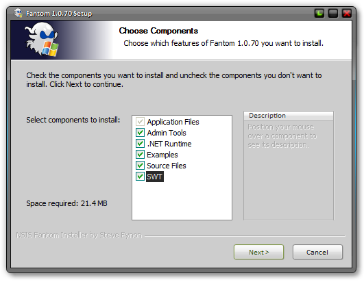

# Fantom v1.0.82 for Windows
---

## Overview

Download the latest installer on the [Releases Page](https://github.com/Fantom-Factory/fantomWindowsInstaller/releases/latest).

This is a Windows installer for the [Fantom Programming Language](https://fantom.org/). 

It installs Fantom, compete with SWT for 64 bit platforms, and sets all required environment variables.

## The Installer

The installer contains the standard Fantom distribution as available [here](https://github.com/fantom-lang/fantom/releases) and unpacks it into the selected directory.

The installer then sets and updates the `FAN_HOME` and `PATH` environment variables. If Fantom is installed for *"Just Me"* then the user's environment variables are set. If installed for *"All Users"* then the System environment variables are updated.

## What's in it?

This distribution differs slightly from the *official* distribution as this download also contains support for SWT / FWT on 64 bit Windows.

`etc/sys/config.props` has also been altered slighly:

 - `errTraceMaxDepth` has been increased from 25 to 50 to give longer stack traces
 - `debug` has been set to `true` to enable JVM debugging in IDE's like [F4](https://github.com/xored/f4)

Also, this download doesn't contain those annoying `.DS_Store` junk files for MacOS!

## Fantom Work Directory

If you wish to keep your Fantom installation pristine and clean, then set up a work directory by setting these optional environment variables:

    set FAN_ENV=util::PathEnv
	set FAN_ENV_PATH=%UserProfile%\fantom-workDir

See [Path Env](http://fantom.org/doc/docLang/Env#PathEnv) for details.

## Pre-Requisites

The installer assumes the system already has Java installed. JRE 1.8 or later is required to run Fantom programs.

## Built by NSIS

The installer was created with [NSIS 3.02.1](https://nsis.sourceforge.io/Main_Page) and built with the [large strings](http://nsis.sourceforge.net/Special_Builds) variant to work around problems inherent with altering the `PATH` environment variable.

The `/SOLID lzma` compressor created the smallest installer.

## Licence

Fantom is licensed under the [Academic Free Licence](http://opensource.org/licenses/AFL-3.0) and this installer is licensed under the [ISC Licence](http://opensource.org/licenses/ISC).
